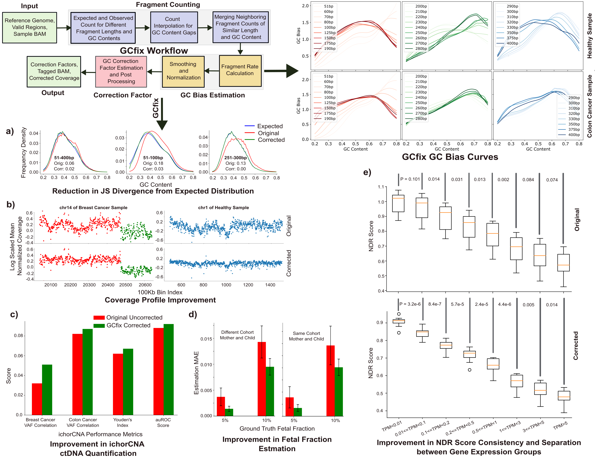

# GCfix
GCfix is a fast and accurate software for cell free GC correction. It provides accurate fragment length specific correction factors for both deep and low pass whole genome sequencing samples. The software works for all reference genomes. It can provide GC correction factor tagged bam files and and corrected coverage profiles as output for easy usage.
<div align="center">
  
</div> 


## Required Installations

To get started, ensure you have the following installed:

- **Python**: `3.10.6`
- **Pysam**: `0.19.1`
- **NumPy**: `1.23.1`
- **Pandas**: `1.5.1`
- **Statsmodels**: `0.14.1`
- **Samtools**: `1.6`

You can install these software libraries using `pip` or `conda`


## Running GCfix

1. **Download Reference Genomes**:
   - Download the `hg19_ref.fa` and `hg38_ref.fa` reference genome files from [Zenodo](https://zenodo.org/records/13924466).
     - Rename `hg19_ref.fa` to `ref.fa` and place it in the `hg19__GRCh37/` folder.
     - Rename `hg38_ref.fa` to `ref.fa` and place it in the `hg38/` folder.

2. **Run GCfix**:
   - Execute `GCfix_run.py` from its location using the following command:

     ```bash
     python GCfix_run.py --input_folder <INPUT_FOLDER> --output_folder <OUTPUT_FOLDER> --MAPQ <MAPQ> --start_length <START_LENGTH> --end_length <END_LENGTH> --CPU <CPU> --ref <REF> --ref_genome_GC <REF_GC> --GC_estimation_regions <ESTIMATION_REGIONS> --GC_tagging_flag <GC_TAGGING_FLAG> --GC_tagging_regions <GC_TAGGING_REGIONS> --GC_tagging_folder <GC_TAGGING_FOLDER> --coverage_flag <COVERAGE_FLAG> --coverage_regions <COVERAGE_REGIONS> --coverage_folder <COVERAGE_FOLDER>
     ```

3. **Command Line Argument Descriptions**:
   - **INPUT_FOLDER**: Path to the folder containing BAM files (must be mapped to the same reference genome) for correction, including `.bai` index files.  
     _Required argument, string type._
   - **OUTPUT_FOLDER**: Directory where correction factor CSV files for the input BAM files will be generated.  
     _Required argument, string type._
   - **MAPQ**: Minimum mapping quality of reads used for GC correction factor estimation.  
     _Optional argument, integer type (default: 30)._
   - **START_LENGTH**: Smallest fragment length of interest.  
     _Optional argument, integer type (default: 51; recommended minimum: 51)._
   - **END_LENGTH**: Largest fragment length of interest.  
     _Optional argument, integer type (default: 400)._
   - **CPU**: Number of CPUs to use for parallel processing.  
     _Optional argument, integer type (default: 32)._
   - **REF**: Reference genome file for GC bias estimation.  
     _Optional argument, string type (default: `hg19__GRCh37/ref.fa`)._
   - **REF_GC**: Path to expected GC count frequencies from the reference genome (`.npy` file).  
     _Optional argument, string type (default: `hg19__GRCh37/ref_genome_GC.npy`)._
   - **ESTIMATION_REGIONS**: Path to the genome region list for GC bias estimation.  
     _Optional argument, string type (default: `hg19__GRCh37/correction_factor_estimation_bin_locations.csv`)._
     - The default bin regions consist of over 25,000 bins (each 100Kb) from the hg19/GRCh37 reference genome, excluding low-quality, blacklist, unusual, and low mappability regions.
   - **GC_TAGGING_FLAG**: Indicates whether to generate tagged BAM files with GC correction factors for each read.  
     _Optional argument, integer type (default: 0)._
     - **1**: Creates tagged BAM files with a `"GC"` tag.
     - **0**: No tagging.
   - **GC_TAGGING_REGIONS**: Path to the genome region list for tagging reads with their GC correction factors.  
     _Optional argument, string type (default: `hg19__GRCh37/GC_tagging_bin_locations.csv`)._
     - Relevant only if `GC_TAGGING_FLAG` is set to 1.
   - **GC_TAGGING_FOLDER**: Directory for outputting tagged BAM files.  
     _Optional argument, string type (default: `Sample_Output/Tagged_Bams/`)._
     - Relevant only if `GC_TAGGING_FLAG` is set to 1.
   - **COVERAGE_FLAG**: Indicates whether to generate corrected coverage profiles.  
     _Optional argument, integer type (default: 0)._
     - **1**: Generates corrected coverage profiles.
     - **0**: No coverage profiles generated.
   - **COVERAGE_REGIONS**: Path to the genome region list for which corrected read counts are desired.  
     _Optional argument, string type (default: `hg19__GRCh37/correction_factor_estimation_bin_locations.csv`)._
     - Relevant only if `COVERAGE_FLAG` is set to 1.
   - **COVERAGE_FOLDER**: Directory for outputting corrected coverage profiles.  
     _Optional argument, string type (default: `Sample_Output/Coverage_Profiles/`)._
     - Relevant only if `COVERAGE_FLAG` is set to 1.


## Example Run

- **Running Command:**
    ```bash
    python GCfix_run.py --input_folder Input_Bam/ --output_folder Sample_Output/Correction_Factors/ --MAPQ 30 --start_length 51 --end_length 400 --CPU 32 --ref hg19__GRCh37/ref.fa --ref_genome_GC hg19__GRCh37/ref_genome_GC.npy --GC_estimation_regions hg19__GRCh37/correction_factor_estimation_bin_locations.csv --GC_tagging_flag 1 --GC_tagging_regions hg19__GRCh37/GC_tagging_bin_locations.csv --GC_tagging_folder Sample_Output/Tagged_Bams/ --coverage_flag 1 --coverage_regions hg19__GRCh37/correction_factor_estimation_bin_locations.csv --coverage_folder Sample_Output/Coverage_Profiles/
     ```
- 2 sample bam files are provided in the `Input_Bam/` folder
- GCfix output for them are provided inside the `Sample_Output/` folder:
    - **Correction factors:** `Sample_Output/Correction_Factors/`
        - 2 `.csv` files produced which contain the correction factors of the 2 input samples 
        - Number of rows equals to the number of fragment lengths between 51 and 400 (total row no: 400-51+1=350); where the first and the last row correspond to GC correction factors of the lowest (51) and the highest (400) fragment length, respectively
        - Number of columns is 101 (labeled as: 0, 1, 2, ..., 100; signifies GC content percentage)
    - **Correction factor tagged bams:** `Sample_Output/Tagged_Bams/`
        - 2 tagged bam files (along with their index files) created for the 2 input samples
        - Look for the `"GC"` tag in each read of the tagged bams to get the GC correction factor per read
    - **Corrected coverage profiles:** `Sample_Output/Coverage_Profiles/`
        - 2 `.csv` files produced which contain GC corrected read counts for the input genomic regions of the 2 input samples


## Applying GCfix on Samples Aligned to Different Reference Genomes

- The following arguments will change according to reference genome:
    - `--ref`
    - `--ref_genome_GC`
    - `--GC_estimation_regions`
    - `--GC_tagging_regions`
    - `--coverage_regions`
- Files to use for hg19/GRCh37 mapped bam files can be found inside the `hg19__GRCh37/` folder (GCfix default parameters)
- Corresponding files to use for hg38 mapped bam files can be found inside the `hg38/` folder


## How to Use a Reference Genome Other than hg19/GRCh37/hg38

- Download the reference genome file in `.fa` format and create the corresponding `.fai` index file using the following samtools command:
    ```bash
    samtools faidx <ref_genome.fa>
    ```
- Go inside `ref_genome_GC_generate/` folder and run `all_ref_GC_frequency.py`:
    ```bash
    python all_ref_GC_frequency.py --ref <REF> --output_folder <OUTPUT_FOLDER> --start_length <START_LENGTH> --end_length <END_LENGTH> --CPU <CPU> --regions <REGIONS>
    ```
    - **REF**: Reference genome (example file: `../hg19__GRCh37/ref.fa`; `.fai` file should be in the same folder) to use for GC bias estimation<br>
     _required argument, string type_
    - **OUTPUT_FOLDER**: Folder where expected GC content frequencies for different fragment lengths will be stored<br>
     _required argument, string type_
    - **START_LENGTH**: Smallest fragment length of interest<br>
     _optional argument, integer type (default value: 51)_
    - **END_LENGTH**: Largest fragment length of interest<br>
     _optional argument, integer type (default value: 400)_
    - **CPU**: Number of CPU to use for parallel processing<br> 
     _optional argument, integer type (default value: 32)_
    - **REGIONS**: Valid genome region list (example file for hg19: `../hg19__GRCh37/correction_factor_estimation_bin_locations.csv`) based on which GC bias will be estimated<br>
     _required argument, string type_
- Running `all_ref_GC_frequency.py` as mentioned above will create a `ref_genome_GC.npy` file inside your provided OUTPUT_FOLDER folder:
    - This file contains the expected GC count frequencies from the reference genome
    - This file needs to be created only once for a single new reference genome
- In order to run `GCfix_run.py` on this new reference genome, set the correct paths for:
    - `--ref` (downloaded `.fa` reference genome file; `.fai` file should be in the same folder)
    - `--ref_genome_GC` (the `ref_genome_GC.npy` you just created following this section)
    - `--GC_estimation_regions` (`.csv` file full of valid genomic regions of the reference genome)
    - `--GC_tagging_regions` (`.csv` file full of genomic regions of the reference genome -> you want the reads of these regions to be tagged by the estimated correction factors)
    - `--coverage_regions` (`.csv` file full of genomic regions of the reference genome -> you want to get the corrected read counts of these specific regions for this reference genome mapped samples)


## Sample Codes
- In the `Sample_Codes/` folder, you will find two `.py` files:
  - `count_bam_fragments_using_tagged_bam.py` provides a sample code for using the GC correction factor tagged BAM file.
  - `count_bam_fragments_using_correction_factor_csv.py` provides a sample code for directly using the CSV file full of GC correction factors.
- Note that generating the correction factors and corrected coverage profiles are much faster than generating tagged BAM files.

## Runtime and Memory
- Runtime vs memory plot for 1X and 50X WGS have been provided for the software using 32 cores for parallel processing in the `Runtime_Memory/` folder.
  - It takes only 7 seconds to complete a run on a single 1X WGS BAM, while taking around 200 seconds for 50X WGS (runtime increases sub-linearly).
  - The memory requirement is always less than 20 MB irrespective of sample coverage depth.
- Note that these plots are for correction factor CSV file generation only.
  - If you want to do GC tagging of BAMs as well, the software will require more time.
  - It takes approximately 5 and 50 minutes to tag a single 1X WGS BAM and a single 50X WGS BAM, respectively using 32 cores and all regions of the human reference genome.
  - The memory requirement does not increase if you are tagging BAMs with GC correction factors.

